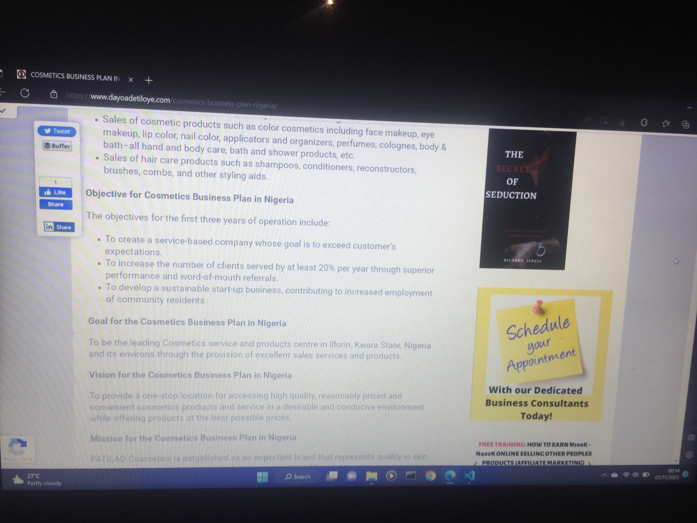

<a href="https://youtu.be/yDhexst-DSI">watch me coding</a>

# Onabote

## A Website Content Hacker.
#### This is a windows light weight software use for hacking website that restrict user from copying content (+ no right click) and other trick, easy to use.

#### Follow this steps to install the software

1. git clone this repo
2. copy the release folder to your desier path
3. execute onabote.exe then you good to go

#### Usage Image are shown below

##### Before Using Onabote Tool, this <a href="https://www.dayoadetiloye.com/cosmetics-business-plan-nigeria/">website</a>won't even allow screenshot

##### After Using Onabote Tool, i can do anything................

#### Tested(On My PC) work so fine
##### I know you not gonna be using my pc but it work so fine on my pc